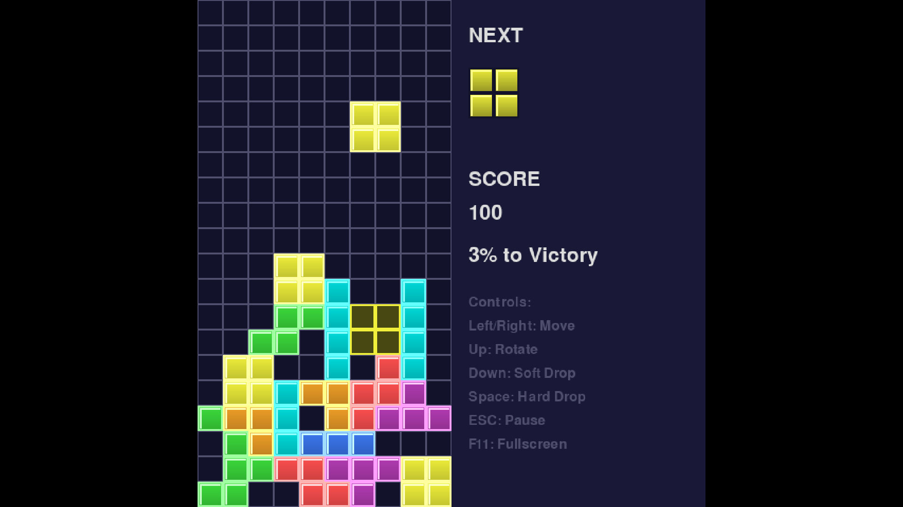

# Tetris

Реализация классической игры Тетрис с использованием Pygame.

**Цель игры:** Набрать 3000 очков для победы, очищая линии падающими фигурами.

---

## Установка и запуск

1. **Клонирование репозитория:**
   ```bash
   git clone https://github.com/Esoteria11/tetris-project.git
   cd tetris-project
   ```

2. **Создание виртуального окружения:**
   ```bash
   # Linux/macOS
   python3 -m venv venv
   source venv/bin/activate

   # Windows
   python -m venv venv
   venv\Scripts\activate
   ```

3. **Установка зависимости:**
   ```bash
   pip install -r requirements.txt
   ```

4. **Запуск игры:**
   ```bash
   python main.py
   ```


## Технологии

- **Python (3.12.3)**
- **Pygame (2.6.1)**
- **Git**
- **GitHub**


## Лицензия

Проект распространяется под лицензией MIT. См. файл [LICENSE](LICENSE).


## Демо
